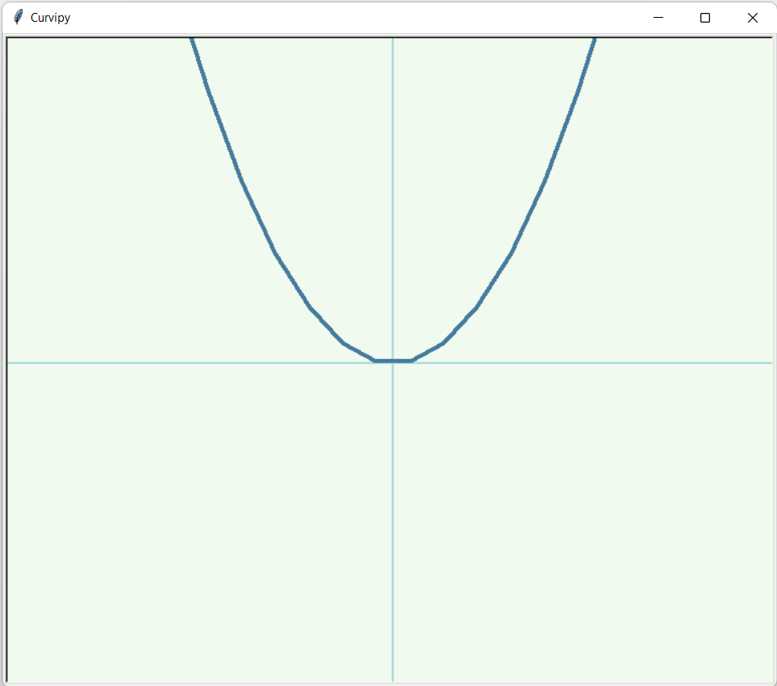

[](https://pepy.tech/project/curvipy)


# What is Curvipy?

Curvipy is a Python library for making math animations in a few lines of code.

Curvipy is inspired on manim, an animation engine for making math videos. Despite manim being an exceptionally tool, it is quite hard to learn and use, specially for simple animations. Curvipy solves this issue by providing a less powerful but much easier to use package, with which you can plot two-dimensional curves and vectors.

# Installation

You can start using Curvipy by installing it via pip.

```
$ pip install curvipy
```

# Usage Example

Curvipy is a great tool for learning and teaching math with animations. In this section you can find different topics being explained with Curvipy.

## Functions Translations

A function has been translated when it has been moved in a way that does not change its shape or rotate it in any way. A function can be translated either *vertically*, *horizontally*, or both.

To visualize translations, we will use the function $f(x) = x^{2}$.

```python
import curvipy


def f(x):
    return x**2


plotter = curvipy.Plotter(x_axis_scale=50, y_axis_scale=20)
interval = curvipy.Interval(start=-15, end=15, samples=45)
plotter.plot_curve(curvipy.Function(f), interval)

plotter.wait()
```

<p align="center">
  
</p>


### Horizontal Translation

In a horizontal translation, the function is moved along the x-axis.

```python
import curvipy


def f(x):
    return x**2


def g(x):
    """f(x) moved 3 units to the right."""
    return f(x - 3)


def m(x):
    """f(x) moved 3 units to the left."""
    return f(x + 3)


plotter = curvipy.Plotter(x_axis_scale=50, y_axis_scale=20, plotting_speed=3)
plotter.curve_color = "#FF7B61"  # Red
interval = curvipy.Interval(start=-2, end=7.5, samples=45)
plotter.plot_curve(curvipy.Function(g), interval)
plotter.curve_color = "#F061FF"  # Purple
interval = curvipy.Interval(start=-7.5, end=2, samples=45)
plotter.plot_curve(curvipy.Function(m), interval)

plotter.wait()
```

<p align="center">
  
</p>

### Vertical Translation

In a horizontal translation, the function is moved along the y-axis.

```python
import curvipy


def f(x):
    return x**2


def g(x):
    """f(x) moved 3 units down."""
    return f(x) - 3


def m(x):
    """f(x) moved 3 units up."""
    return f(x) + 3


plotter = curvipy.Plotter(x_axis_scale=50, y_axis_scale=20, plotting_speed=3)
interval = curvipy.Interval(start=-5, end=5, samples=45)
plotter.curve_color = "#FF7B61"  # Red
plotter.plot_curve(curvipy.Function(g), interval)
plotter.curve_color = "#F061FF"  # Purple
plotter.plot_curve(curvipy.Function(m), interval)

plotter.wait()
```

<p align="center">
  
</p>

## Linear transformations

A linear transformation is a mapping $V \rightarrow W$ between two vector spaces that preserves the operations of vector addition and scalar multiplication.

Curvipy is great for visualizing how a linear transformation transform the two-dimensional space.

### Transformation matrix

In linear algebra, linear transformations can be represented by matrices. If $T$ is a linear transformation mapping $R^n$ to $R^m$ and $\vec{x}$ is a column vector then

$T(\vec{x}) = A\vec{x}$

where $A$ is an $m x n$ matrix called the *transformation matrix* of $T$.

With Curvipy, you can visualize how linear transformations transforms two-dimensional curves with the `curvipy.TransformedCurve` class. Let's visualize how the matrix

$$
A =
\begin{bmatrix}
0 & -1\\
1 & 0
\end{bmatrix}
$$

transforms the function $f(x) =\frac{x}{2}sin(x)$.

```python
import math
import curvipy


def f(x):
    return x / 2 * math.sin(x)


plotter = curvipy.Plotter(x_axis_scale=25, y_axis_scale=25)
interval = curvipy.Interval(-15, 15, 250)

# Plot curve f(x) = x/2 * sin(x):
plotter.curve_color = "#FF7B61"  # Red
curve = curvipy.Function(f)
plotter.plot_curve(curve, interval)

# Plot transformed curve:
plotter.curve_color = "#457B9D"  # Blue
A = ((0, -1), (1, 0))
transformed_curve = curvipy.TransformedCurve(A, curve)
plotter.plot_curve(transformed_curve, interval)

plotter.wait()
```

<p align="center">
  
</p>

As you can see above, the matrix $A$ rotates the function $f(x)$ ninety degree anticlockwise.

**Note:**  `curvipy.TransformedCurve`
matrix parameter has the same format as numpy arrays. In fact, you can directly use a numpy array. 

### Matrix multiplication commutative property

For matrix multiplication, the commutative property of multiplication does not hold. This means that, given two matrices $A$ and $B$, generally $AB {\neq} BA$.

To prove this, let's define the matrices

$$
A =
\begin{bmatrix}
0 & -1\\
1 & 0
\end{bmatrix}
$$

$$
B = 
\begin{bmatrix}
1 & 1\\
0 & 1
\end{bmatrix}
$$

and see how they transform the curve $f(x) = x^{3}$.

```python
import curvipy


def f(x):
    return x**3


plotter = curvipy.Plotter(
    x_axis_scale=25,
    y_axis_scale=25,
    curve_width=6,
    plotting_speed=3,
)
interval = curvipy.Interval(-2.7, 2.7, 70)

# Define curves
A = ((0, -1), (1, 0))
B = ((1, 1), (0, 1))
curve = curvipy.Function(f)
AB_transformed_curve = curvipy.TransformedCurve(A, curvipy.TransformedCurve(B, curve))
BA_transformed_curve = curvipy.TransformedCurve(B, curvipy.TransformedCurve(A, curve))

# Plot f(x) = x^3 in Orange:
plotter.curve_color = "#FFC947"  # Yellow
plotter.plot_curve(curve, interval)

# Plot AB transformed curve in Red:
plotter.curve_color = "#FF7B61"  # Red
plotter.plot_curve(AB_transformed_curve, interval)

# Plot BA transformed curve in Blue:
plotter.curve_color = "#457B9D"  # Blue
plotter.plot_curve(BA_transformed_curve, interval)

plotter.wait()
```

<p align="center">
  
</p>

As you can see above, transforming $f(x)$ with the matrix $AB$ gives a different result as transforming $f(x)$ with the matrix $BA$.

**Tip:** you can also use numpy arrays to define `AB_transformed_curve` and `BA_transformed_curve` curves, as shown below.

```python
import numpy as np
import curvipy


A = np.array(((0, -1), (1, 0)))
B = np.array(((1, 1), (0, 1)))
AB = np.matmul(A, B)
BA = np.matmul(B, A)


AB_transformed_curve = curvipy.TransformedCurve(AB, curve)
BA_transformed_curve = curvipy.TransformedCurve(BA, curve)
```

You can learn more about Curvipy by going through the [Documentation](documentation.md) section or by directly visiting Curvipy on [Github](https://github.com/dylannalex/curvipy) in order to check out the source code itself.