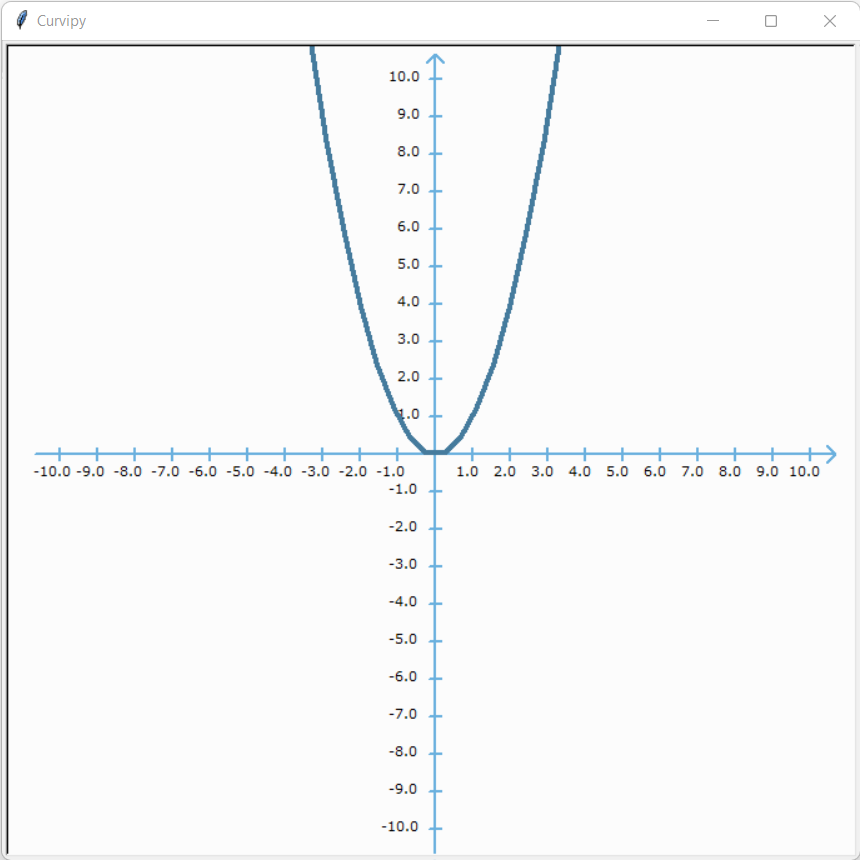

# What is Curvipy?

Curvipy is a Python library for making math animations in a few lines of code.

Curvipy is inspired on [manim](https://github.com/3b1b/manim), an animation engine for making math videos. Despite manim being an exceptionally tool, it is quite hard to learn and use, specially for simple animations. Curvipy solves this issue by providing a less powerful but much easier to use package, with which you can plot two-dimensional curves and vectors.

# Installation

You can start using Curvipy by installing it via pip.

```{code-block}
$ pip install curvipy
```

```{note} Curvipy requires [turtle](https://docs.python.org/3/library/turtle.html) package. If you don't have it, it will be automatically installed.
```

# Usage Example

Curvipy is a great tool for learning and teaching math with animations. In this section you can find different topics being explained with Curvipy.

## Functions Translations

A function has been translated when it has been moved in a way that does not change its shape or rotate it in any way. A function can be translated either *vertically*, *horizontally*, or both.

To visualize translations, we will use the function {math}`f(x) = x^{2}`.

```python
import curvipy


def f(x):
    return x**2


plotter = curvipy.Plotter()
interval = curvipy.Interval(start=-10, end=10, samples=45)
curve = curvipy.Function(f, interval)
plotter.plot_curve(curve)
plotter.wait()
```

{width="500px" align=center}

### Horizontal Translation

In a horizontal translation, the function is moved along the x-axis.

```python
import curvipy


def f(x):
    return x**2


def g(x):
    """f(x) moved 3 units to the right."""
    return f(x - 3)


def m(x):
    """f(x) moved 3 units to the left."""
    return f(x + 3)


plotter = curvipy.Plotter()

plotter.plotting_config.curve_color = "#FF7B61"  # Red
interval = curvipy.Interval(start=-2, end=7.5, samples=45)
plotter.plot_curve(curvipy.Function(g, interval))

plotter.plotting_config.curve_color = "#F061FF"  # Purple
interval = curvipy.Interval(start=-7.5, end=2, samples=45)
plotter.plot_curve(curvipy.Function(m, interval))

plotter.wait()
```

{width="500px" align=center}

### Vertical Translation

In a horizontal translation, the function is moved along the y-axis.

```python
import curvipy


def f(x):
    return x**2


def g(x):
    """f(x) moved 3 units down."""
    return f(x) - 3


def m(x):
    """f(x) moved 3 units up."""
    return f(x) + 3


plotter = curvipy.Plotter()
interval = curvipy.Interval(start=-5, end=5, samples=45)

plotter.plotting_config.curve_color = "#FF7B61"  # Red
plotter.plot_curve(curvipy.Function(g, interval))

plotter.plotting_config.curve_color = "#F061FF"  # Purple
plotter.plot_curve(curvipy.Function(m, interval))

plotter.wait()
```

{width="500px" align=center}

## Linear transformations

A linear transformation {math}`f` is a mapping between two vector spaces

```{math}
f:\mathcal{V}\rightarrow\mathcal{W}
```

that preserves the operations of vector addition and scalar multiplication. If, {math}`\vec{v_1},\vec{v_2}\in\mathcal{V}` and {math}`a_1` and {math}`a_2` are scalars, then:

```{math}
f(a_1\vec{v_1}+a_2\vec{v_2})=a_1f(\vec{v_1})+a_2f(\vec{v_2})
```

Curvipy is great for visualizing how a linear transformation transform the two-dimensional space.

### Transformation matrix

In linear algebra, linear transformations can be represented by matrices. If {math}`T` is a linear transformation mapping {math}`\mathbb{R}^n` to {math}`\mathbb{R}^m` and {math}`\vec{x}` is a column vector then

```{math}
T(\vec{x})=A\vec{x}
```

where {math}`A` is an {math}`m \times n` matrix called the *transformation matrix* of {math}`T`.

With Curvipy, you can visualize how linear transformations transforms two-dimensional curves with the [TransformedCurve](curvipy.TransformedCurve) class. Let's visualize how the matrix

```{math}
A = \begin{bmatrix}0 & -1\\1 & 0\end{bmatrix}
```

transforms the function {math}`f(x) =\frac{x}{2}\sin(x)`.

```python
import math
import curvipy


def f(x):
    return x / 2 * math.sin(x)


plotter = curvipy.Plotter()
interval = curvipy.Interval(-10, 10, 200)

# Plot curve f(x) = x/2 * sin(x):
plotter.plotting_config.curve_color = "#FF7B61"  # Red
curve = curvipy.Function(f, interval)
plotter.plot_curve(curve)

# Plot transformed curve:
plotter.plotting_config.curve_color = "#457B9D"  # Blue
A = ((0, -1), (1, 0))
transformed_curve = curvipy.TransformedCurve(A, curve)
plotter.plot_curve(transformed_curve)

plotter.wait()
```

{width="500px" align=center}

As you can see above, the matrix {math}`A` rotates the function {math}`f(x)` ninety degree anticlockwise.

```{note} 
[TransformedCurve](curvipy.TransformedCurve)
matrix parameter has the same format as numpy arrays. In fact, you can directly use a numpy array. 
```

### Matrix multiplication commutative property

For matrix multiplication, the commutative property of multiplication does not hold. This means that, given two matrices {math}`A` and {math}`B`, generally {math}`AB {\neq} BA`.

To prove this, let's define the matrices

```{math}
A = \begin{bmatrix}0 & -1\\1 & 0\end{bmatrix} \text{and } B =\begin{bmatrix}1 & 1\\0 & 1\end{bmatrix}
```

and see how they transform the curve {math}`f(x) = x^{3}`.

```python
import curvipy


def f(x):
    return x**3


plotter = curvipy.Plotter()
interval = curvipy.Interval(-2.5, 2.5, 70)

# Define curves
A = ((0, -1), (1, 0))
B = ((1, 1), (0, 1))
curve = curvipy.Function(f, interval)
AB_transformed_curve = curvipy.TransformedCurve(A, curvipy.TransformedCurve(B, curve))
BA_transformed_curve = curvipy.TransformedCurve(B, curvipy.TransformedCurve(A, curve))

# Plot f(x) = x^3 in Yellow:
plotter.plotting_config.curve_color = "#FFC947"  # Yellow
plotter.plot_curve(curve)

# Plot AB transformed curve in Red:
plotter.plotting_config.curve_color = "#FF7B61"  # Red
plotter.plot_curve(AB_transformed_curve)

# Plot BA transformed curve in Blue:
plotter.plotting_config.curve_color = "#457B9D"  # Blue
plotter.plot_curve(BA_transformed_curve)

plotter.wait()
```

{width="500px" align=center}

As you can see above, transforming {math}`f(x)` with the matrix {math}`AB` gives a different result as transforming {math}`f(x)` with the matrix {math}`BA`.

You can also use numpy arrays to define **AB_transformed_curve** and **BA_transformed_curve** curves:

```python
import numpy as np
import curvipy


A = np.array(((0, -1), (1, 0)))
B = np.array(((1, 1), (0, 1)))
AB = np.matmul(A, B)
BA = np.matmul(B, A)


AB_transformed_curve = curvipy.TransformedCurve(AB, curve)
BA_transformed_curve = curvipy.TransformedCurve(BA, curve)
```

You can learn more about Curvipy by going through the [Documentation](documentation.md) section or by directly visiting Curvipy on [Github](https://github.com/dylannalex/curvipy) in order to check out the source code itself.